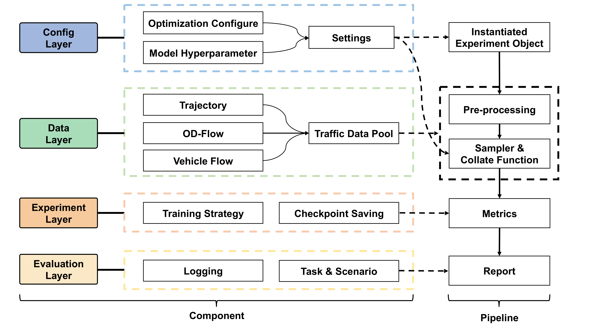

<br clear="left" /><br>

------

[](https://www.python.org/) [](https://pytorch.org/) 

# MTGBench

[数据集下载](https://cilab-urbandata.github.io/) | [数据集处理源码](https://github.com/CILAB-UrbanData/MTGBench-Dataset) | [会议论文]() | [English](https://github.com/CILAB-UrbanData/MTGBench/blob/master/README.md)

MTGBench是一个统一、新型的、可扩展的代码库，为新兴的交通预测任务提供了一个可靠的开发和测试框架。我们的库基于PyTorch实现，并且在 [TSLib](https://github.com/thuml/Time-Series-Library/tree/main), [LibCity](https://github.com/LibCity/Bigscity-LibCity?tab=readme-ov-file) 这样的优秀开源框架下进行改进

MTGBench 目前支持以下任务：

* 交通状态预测
  * 基于轨迹的交通状态预测
  * 基于订单数据的交通状态预测
  
## Features

* **统一性**：MTGBench 构建了一个系统的流水线以在一个统一的平台上实现、使用和评估交通预测模型。 我们设计了统一的时空数据存储格式、统一的模型实例化接口和标准的模型评估程序。
  
* **新型性**：不同于前几年关注的单一交通预测问题，我们的复现主要涵盖了面向新兴的交通预测问题，比如输入不止有交通状态还有轨迹或者OD Flow的状态预测模型。
  
* **可扩展性**：MTGBench 实现了不同组件的模块化设计，允许用户灵活地加入自定义组件。 因此，新的研究人员可以在 MTGBench 的支持下轻松开发新模型。
  
## Overall Framework

<br clear="left" /><br>

* **./scripts/**: 该文件夹下是各个任务各个模型的启动脚本，包含了所需的超参
* **./data_provider/**: 该文件夹下 data_factory.py 负责实例化各个data_loader对象，./data_provider/data_loader/ 下则为各个模型从规范化数据读取，预处理，采样的逻辑
* **./exp/**: 该文件夹下存储每个任务统一好的训练和评估脚本
* **run.py**: 主程序入口，读取超参，实例化exp类，并执行exp的train方法和test方法
  
## Quick-Start
在 MTGBench 中运行模型之前，请确保您至少下载了一个数据集并将其放在目录 ./data/ 中。 

数据集链接是 

👉 [数据集下载](https://cilab-urbandata.github.io/)。

数据集格式要求

👉 [数据集处理源码](https://github.com/CILAB-UrbanData/MTGBench-Dataset) 

要启动训练或者测试只需
```bash
./scripts/traffic_prediction/sf/TrGNN.sh
```

该脚本将在默认配置下，在 SanFrancisco 数据集上运行 GRU 模型，以进行交通状态预测任务。

## Tutorial
* 在 `./models` 文件夹下添加模型文件。你可以参考 `./models/TrGNN.py`
  
* 把模型注册到 `./exp/exp_basic.py` 里的 `Exp_Basic.model_dict`

* 把数据处理程序注册到 `./data_provider/data_factory.py` 里的 `data_dict` 以及 `./data_provider/data_loader/__init__.py`

* 增加相应的 `scripts` 文件